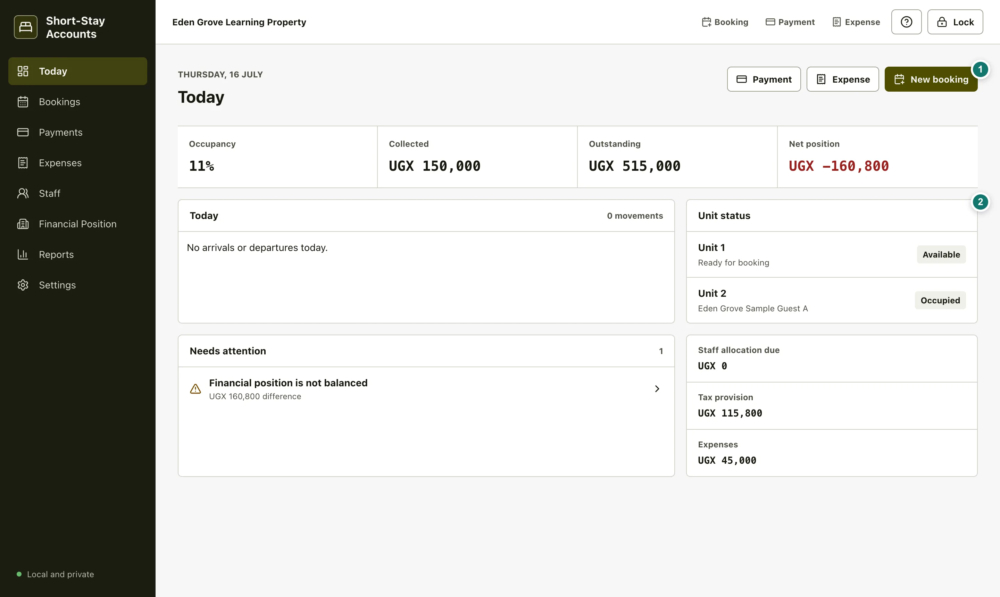
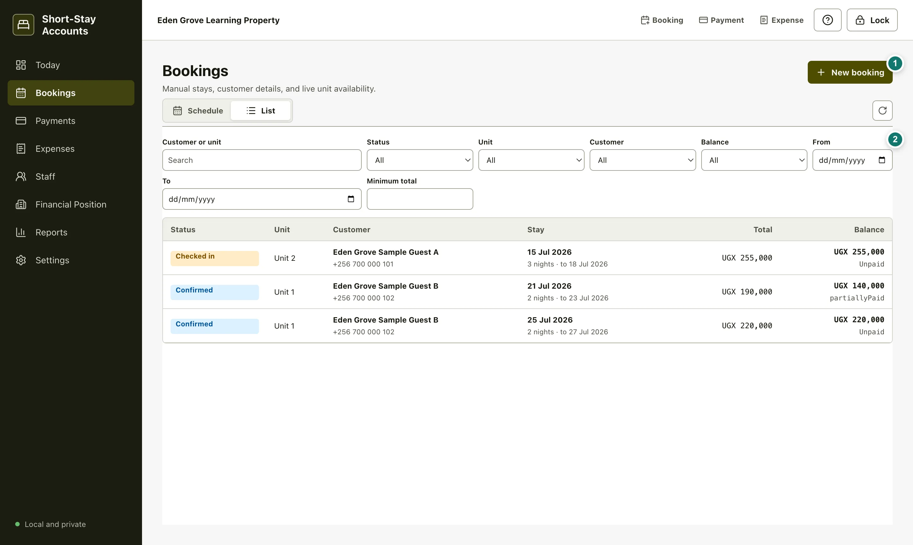
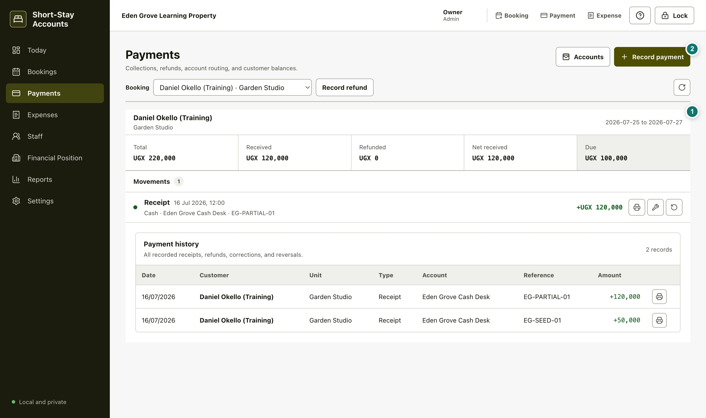
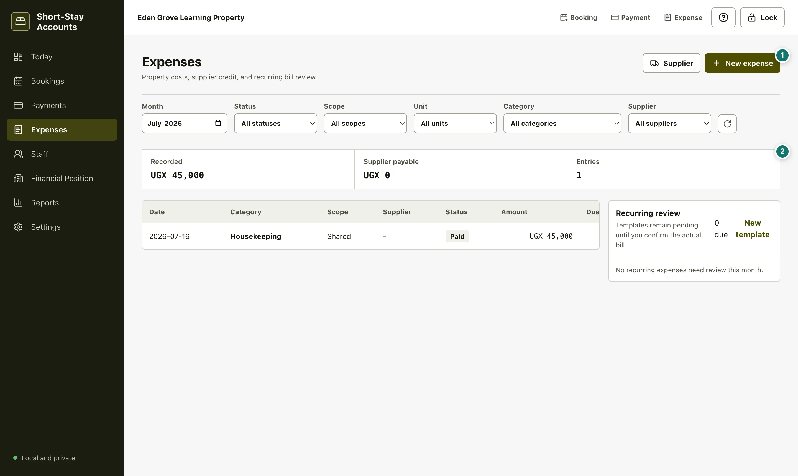
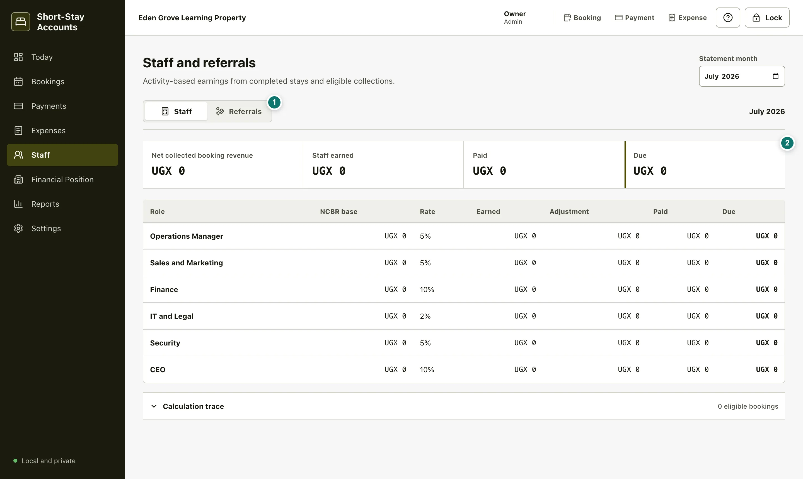
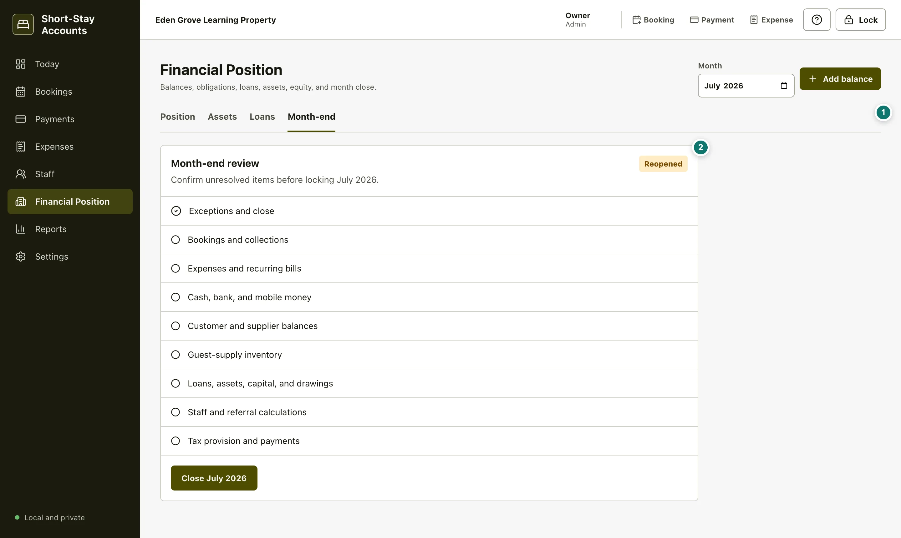
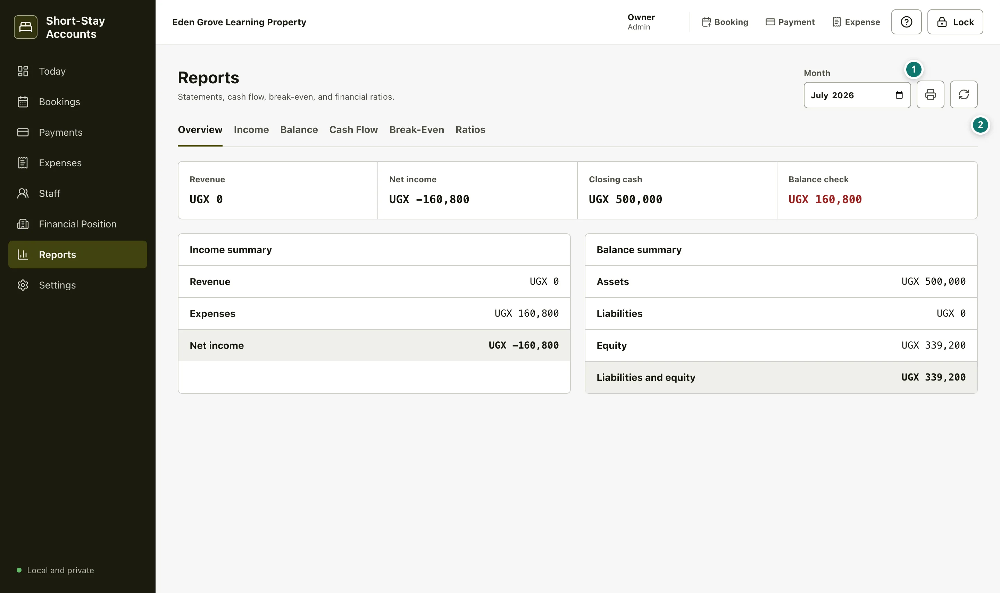
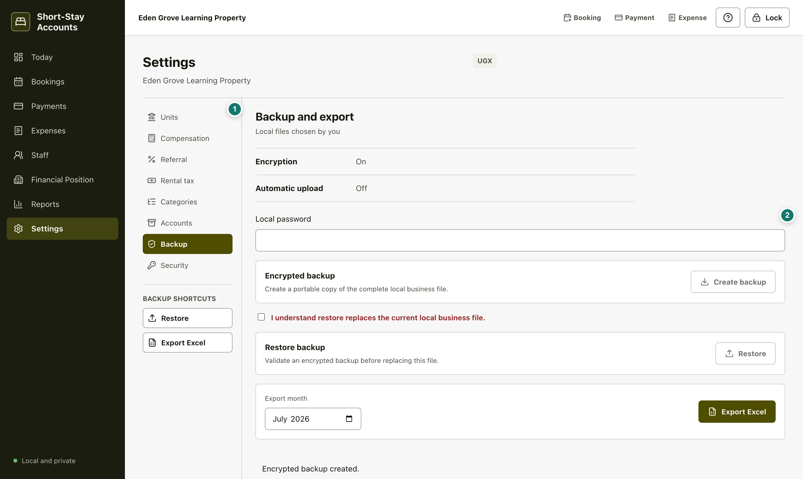
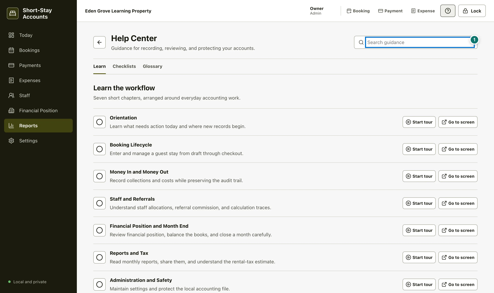

# Short-Stay Accounts: Complete Beginner Handbook

This handbook teaches the complete Short-Stay Accounts workflow using one fictional business only: **Eden Grove Learning Property**, with two active units, **Garden Studio** and **Courtyard Suite**. The people, bookings, and amounts visible in the guide media are fictional training records.

Short-Stay Accounts is for recording a short-stay business as it happens. Bookings, payments, and expenses are entered **manually**. It does **not** connect to Airbnb or any other booking platform, so enter the information you have received from your booking channel or directly from the guest.

**Contents**

1. [Quick Start](#quick-start)
2. [How Data Stays Private](#how-data-stays-private)
3. [Screen Map](#screen-map)
4. [First Day](#first-day)
5. [Today](#today)
6. [Bookings](#bookings)
7. [Payments](#payments)
8. [Expenses](#expenses)
9. [Staff and Referrals](#staff-and-referrals)
10. [Financial Position](#financial-position)
11. [Month End](#month-end)
12. [Reports and Tax](#reports-and-tax)
13. [Settings and Safety](#settings-and-safety)
14. [Daily Checklist](#daily-checklist)
15. [Per-Booking Checklist](#per-booking-checklist)
16. [Weekly Checklist](#weekly-checklist)
17. [Month-End Checklist](#month-end-checklist)
18. [Backup and Recovery](#backup-and-recovery)
19. [Troubleshooting](#troubleshooting)
20. [Glossary](#glossary)
21. [Client Demonstration Script](#client-demonstration-script)

## Quick Start

1. Open the application and sign in with your profile username and password. If secure operating-system storage is unavailable, the Admin may first be asked for the local business-file password.
2. On the first setup, enter the business name, the two unit names, and a local password of at least 10 characters. Confirm the password before creating the business.
3. Start on **Today**. Read the arrivals, departures, unit status, outstanding amounts, and the attention list before adding anything.
4. Enter a stay in **Bookings**, record actual money in **Payments**, and record business costs in **Expenses**.
5. Use **Financial Position** and **Reports** to check the month before closing it.
6. In **Settings**, keep units, rates, and backup copies current. Lock the application every time you leave the computer.

The working order matters: a booking describes what the guest owes; a payment describes money actually received or returned; an expense describes money the business spent or owes. Do not use one screen to stand in for another.

**Eden Grove worked example.** A guest reserves Garden Studio from 10 July to 13 July at UGX 120,000 per night. The stay is three occupied nights because the checkout date is not an occupied night. Before any adjustment, the booking total is `3 x UGX 120,000 = UGX 360,000`. If a UGX 20,000 discount is entered as an adjustment of `-20,000`, the total becomes UGX 340,000. A UGX 150,000 receipt leaves UGX 190,000 outstanding. That booking, receipt, and any later refund remain separate, traceable records.

## How Data Stays Private

Short-Stay Accounts stores the business data on the local computer. The business file is encrypted and the application is unlocked with the local password. It does not provide cloud sync, online analytics, cloud progress tracking, or a connection to Airbnb.

The business owner is responsible for the password. Choose one that is hard to guess, store it securely outside the computer, and do not send it in messages or put it in a shared note. If the password is lost, access to the encrypted local records and encrypted backups may not be recoverable.

Use **Lock** in the top command bar, or **Settings > Security > Lock now**, before walking away. Locking returns the application to profile sign-in; it does not delete work. Each operator should use their own profile. A backup is also local: choose a separate, secure location such as an approved encrypted drive. A restore replaces the current local business file only after an explicit confirmation.

## Screen Map

The left navigation opens the eight main work areas. The top command bar is available while working: use **Booking**, **Payment**, or **Expense** to jump to that work area; use **Help** for the Help Center and **Lock** to protect the local file. The Today screen also offers **Payment**, **Expense**, and **New booking** shortcuts.

| Screen | Use it for | Main commands and results |
| --- | --- | --- |
| Today | Daily priorities | Read arrivals, departures, warnings, unit status, occupancy, collected money, outstanding balances, and net position. Start a payment, expense, or booking. |
| Bookings | Manual stays | Create, edit, filter, schedule, update status, cancel, and archive stays. |
| Payments | Guest money | Record and print receipts; review refunds, corrections, reversals, accounts, and booking balances according to profile permission. |
| Expenses | Business costs | Record cash costs, supplier credit, suppliers, supplier payments, and recurring bill templates. |
| Staff | Compensation and referrals | Review collected-revenue base, earned, paid, due, configured rates, and calculation traces. |
| Financial Position | What the business owns and owes | Record balances, inventory, fixed assets, loans, and perform month-end review. |
| Reports | Statements | Select a month; view, print, refresh, or export the accounting reports. |
| Settings | Business configuration and safety | Manage users, units, effective-dated rates, tax basis, categories, accounts, backup, export, and lock. Admin only. |

## First Day

On the setup screen, enter the business name, the first two unit names, and a local password twice, then confirm the approved defaults before selecting **Create business**. The approval acknowledges this business's configured 37% total staff allocation, 10% referral commission, and UGX 600,000 monthly rental basis per active unit; it does not make those values a universal standard or turn the monthly basis into tax. Set up only facts you can support. Eden Grove starts with Garden Studio and Courtyard Suite; add each unit in **Settings > Units**. A unit must be active before it can be selected in a booking. Use **Add unit** to add another unit and **Save units** to apply the change. The archive icon makes an existing unit inactive and removes it from ordinary active choices; do not archive a unit merely because it is temporarily empty.

Before entering the first stay, open **Settings > Accounts** and identify the account classifications available for the business: cash, bank, mobile money, card, receivable, payable, equity, and other balances. When a real collection or payment is recorded, choose the real account used. This is what lets cash and account balances reconcile later.

To add Visa, open **Settings > Accounts**, enter a name such as **Visa card**, choose **Card / Visa**, and select **Add account**. The new account then appears in expense and payment account choices.

Then create one test-quality real booking, or use the fictional Eden Grove media only for learning. Check that the nights, rate, total, payment account, and balance make sense before recording any payment. Do not invent a booking simply to make the dashboard look populated.

## Today

**Figure 1. Today.** 1. Use the Payment, Expense, or New booking commands when you are ready to create that type of record. 2. Review the day workspace: its agenda, unit status, attention list, and linked summary work.

Today is a command center, not a place to silently change accounting records. It summarizes the selected day's work and exposes shortcuts to the correct screen. The date heading identifies the day being reviewed.

- **Occupancy** is occupied booking nights for the current month divided by active-unit nights for that month, expressed as a percentage. Cancelled and archived bookings are not counted.
- **Collected** is net guest money received in the current month: receipts less refunds.
- **Outstanding** is the amount still due across active, non-cancelled bookings after their receipts and refunds.
- **Net position** is the current month's net income from the accounting report; it is not the cash balance.
- The agenda gives arrivals and departures. A departure with money still due produces a balance-due warning.
- The attention list can also flag unpaid staff allocations, recurring templates that need review, and an unbalanced financial position. Open the linked screen and resolve the underlying record, rather than dismissing the issue mentally.

For Eden Grove, begin each morning by checking whether Garden Studio or Courtyard Suite is arriving, occupied, or due to check out. Record a collection only after it happens; do not record an expected payment as collected.

## Bookings

**Figure 2. Bookings.** 1. Choose **New booking** to enter a manual stay. 2. In **List**, use the booking filters to find a customer, unit, status, balance state, date range, or minimum total.

### Create a manual booking

1. Select **New booking**, or select an available day in the schedule for Garden Studio or Courtyard Suite.
2. Select the unit. Only active units can be used.
3. Select an existing customer, or choose **+ New customer** and enter the customer's name and phone. Email is optional.
4. Choose **Whole two-bedroom unit** or **One room only**. Two one-room stays may share a unit on the same dates; a whole-unit stay blocks both rooms.
5. Enter check-in and checkout dates. Choose **Nightly rate** for ordinary stays or **Fixed stay or monthly amount** for negotiated and historic monthly rent.
6. Enter the rate or fixed amount and review the automatic total. For nightly pricing the formula is `occupied nights x nightly rate + adjustment`.
7. Enter a positive adjustment for an added charge or a negative adjustment for a discount. Explain the adjustment in notes when it is not obvious.
8. Mark the booking as referred only when a real referrer applies, then enter the referrer's name.
9. Choose **Confirmed** or **Draft** and save. A draft is started but not accepted; confirmed is accepted for the selected unit and dates.

For a new booking, an optional **Initial payment** section lets you record a receipt at the same time. Enter the amount, payment date and time, method, destination account, and reference. Select the overpayment confirmation only when you intentionally receive more than the booking total. A receipt created here is still a payment movement and will appear in the booking balance.

<video controls muted playsinline preload="metadata" poster="media/demo-booking.webp">
  <source src="media/demo-booking.webm" type="video/webm">
  Your browser does not support WebM video. Use the poster image and the steps above.
</video>

**Silent demonstration: creating an Eden Grove booking.** The video shows a manual stay entered for one of the two fictional units, its dates and nightly rate, the live night-and-total calculation, and saving it as confirmed. The static poster is the fallback for readers without video support; no voice narration is required to follow the steps.

### Manage the booking lifecycle

Open a booking from the schedule or its customer name in **List**. The detail panel shows the booking facts and its money movements.

- **Draft** can move to **Confirmed** or **Cancelled**.
- **Confirmed** can move to **Checked in** or **Cancelled**.
- **Checked in** can move to **Completed** or **Cancelled**.
- **Completed** and **Cancelled** are end states in the normal workflow.

Use the visible status command in the booking panel only when the real event has happened. Cancellation releases the unit's future dates for another booking. If facts such as dates, rate, referral information, or notes change before the stay is complete, edit the booking and save it. Do not edit a payment amount here; use Payments so the money history stays intact.

The list filters are for finding records, not changing them. Search by customer or unit, select a status, unit, customer, balance state, date range, or minimum total. **Unpaid** means no money has been recorded. **Outstanding** means the balance is greater than zero. **Paid** in this filter means no balance remains.

To enter the old monthly rent from April to November 2025, create one booking for each rental month, choose **Fixed stay or monthly amount**, enter that month's real rent, complete the booking, and record the receipt in the month it was received. This keeps monthly return and cash reports correctly dated.

To remove a mistaken test booking, open it and select **Remove**, then confirm. It disappears from schedules and reports. A booking with payment history cannot be removed because that would break the audit trail; correct or reverse the payment first, or cancel the booking when the record must remain.

## Payments

**Figure 3. Payments.** 1. Review the selected booking's history and balance before correcting a movement. 2. Use the payment command to record money received or returned against the selected booking.

Payments records guest-money movements against a booking. It does not create the booking total. First choose the booking, then use the amount shown by the booking balance to decide what needs recording.

### Record a receipt or partial payment

1. Select the guest booking.
2. Select **Record receipt**.
3. Enter a positive whole-UGX amount, the actual payment date and time, payment method, account, optional reference, and optional note.
4. Save and check the balance panel.

The payment receipt opens after an incoming payment is saved. Select **Print receipt** to use a physical printer or **Save as PDF** in the system print dialog. To print it again, open **Payments**, select the booking, and use the printer button beside the original receipt. Reprinting does not create another payment.

For Eden Grove's UGX 340,000 booking, a UGX 150,000 receipt produces: received UGX 150,000, refunded UGX 0, net received UGX 150,000, and due UGX 190,000. Its payment state is **Partially paid**. Record the remaining UGX 190,000 only when received; after that, the state becomes **Fully paid**.

<video controls muted playsinline preload="metadata" poster="media/demo-partial-payment.webp">
  <source src="media/demo-partial-payment.webm" type="video/webm">
  Your browser does not support WebM video. Use the poster image and the steps above.
</video>

**Silent demonstration: partial payment.** The video selects a fictional Eden Grove booking, records a receipt to the correct account, and shows the outstanding balance remain after saving. The poster provides the same visual reference in static Markdown readers.

### Refunds, corrections, and reversals

Use **Record refund** when money is genuinely returned to the guest. A refund is a new movement with the refund direction; it reduces net received. It is not a deletion of the original receipt.

If an existing movement is wrong, open that movement in the booking balance and choose its correction or reversal command:

- A **correction** creates a new, reasoned movement that adjusts the record. Enter the correction direction, amount, account, date/time, reference, note, and a clear reason. Use it when the history needs a specific adjustment.
- A **reversal** creates a separate movement that counteracts the original receipt, refund, or correction. Provide the reason. Use it when the original movement should be cancelled out before the correct movement is recorded.

Never silently replace the old transaction or use a new receipt to disguise an error. The point of correction and reversal is a complete audit trail: someone reviewing the booking can see what happened, why it changed, and the final balance. A reversal cannot itself be reversed through the normal action.

<video controls muted playsinline preload="metadata" poster="media/demo-correction.webp">
  <source src="media/demo-correction.webm" type="video/webm">
  Your browser does not support WebM video. Use the poster image and the correction steps above.
</video>

**Silent demonstration: transparent correction.** The video opens an original fictional movement, records a reasoned correction rather than deleting history, and shows the updated booking balance and movement trail. The poster is the static fallback.

### Payment states and amounts

- **Received** is the sum of receipt-direction movements.
- **Refunded** is the sum of refund-direction movements.
- **Net received** is received less refunded.
- **Due** is the booking total less net received, but never less than zero.
- **Unpaid**: no receipt or refund is recorded.
- **Partially paid**: net received is below the booking total.
- **Fully paid**: net received equals the booking total with no refund.
- **Overpaid**: net received is above the booking total.
- **Partially refunded**: a refund exists but net received still equals the total.
- **Fully refunded**: refunds reduce net received to zero or below.

If a balance looks wrong, first check the booking total, all receipts, all refunds, and whether a correction or reversal was made. Then correct the right original movement with a reason.

## Expenses

**Figure 4. Expenses.** 1. Use **Supplier** to add a supplier and **New expense** to record a cost. 2. Read the selected month's recorded amount, supplier payable, and entry count before investigating a difference.

An expense records a business cost. Choose its category and scope: **Unit** when the cost belongs to Garden Studio or Courtyard Suite, or **Shared** when it supports the whole property. The month filter limits the table and summary to the selected month; category, supplier, scope, unit, and status filters help find the record.

### Record a cost

1. Select **New expense**.
2. Enter the expense date, amount, category, and scope. Select the unit when the scope is Unit.
3. Choose **Cash paid** when it was paid immediately, then choose the account that actually paid it.
4. Choose **Supplier credit** when the supplier must be paid later, select the supplier, and add a due date if known.
5. Add reference and notes where they will help later review, then select **Save expense**.

For supplier credit, the expense amount is recorded now and the unpaid portion becomes a supplier payable. It may show **Unpaid** or **Partial** until settled. Select **Pay** on the expense row, enter an amount no greater than its remaining due, payment date, actual account, and reference, then select **Record payment**. This reduces the payable; it does not create a second expense.

Use **Supplier** to add a supplier name and optional phone before recording a credit purchase. Use the filters to review supplier balances due each week.

### Recurring expense review

The recurring area is a review list, not an automatic payment engine. Open **Expenses > Recurring review > New template** to create Netflix, the monthly Yaka service fee, or another repeated cost. Choose **Monthly**, set the next review month, and add the expected amount. When due, confirm the real bill and record the actual expense separately. Do not assume that a template means cash was paid.

## Staff and Referrals

**Figure 5. Staff and referrals.** 1. Switch between the Staff and Referrals monthly statements. 2. Start with the statement totals, especially net collected booking revenue, before explaining earned, paid, or due amounts.

This screen is a monthly statement. It uses eligible collected revenue from completed stays, not the value of every booking entered and not an outstanding balance. **Net collected booking revenue (NCBR)** is the base shown at the top. Each staff or referral line shows its base, rate, earned amount, manual adjustment where applicable, amount paid, and amount due.

For the Eden Grove configuration, there are six configured role rates: Operations Manager 5%, Sales and Marketing 5%, Finance 10%, IT and Legal 2%, Security 5%, and CEO 10%. Together they total **37%**. These are this business's configured allocation categories and rates. They are not six fictional staff records, and they are not a universal accounting, employment, or legal standard. Confirm the business's own agreements before relying on an allocation.

If NCBR is UGX 500,000, the configured role amounts before any adjustment are: Operations UGX 25,000; Sales and Marketing UGX 25,000; Finance UGX 50,000; IT and Legal UGX 10,000; Security UGX 25,000; CEO UGX 50,000; total UGX 185,000. The screen rounds whole-UGX results so the combined result matches the configured percentage total.

A booking marked as referred appears under **Referrals** when it is eligible. Referral commission uses the configured referral rate and its eligible collected base. **Earned** is what the calculation says is due; **Paid** is what has actually been settled; **Due** is the remaining obligation. Use the calculation trace before explaining a figure to a client: it lists the completed booking, unit, stay, earned revenue, and eligible collected base.

Rates are maintained in **Settings > Compensation** and **Settings > Referral**, not by editing the monthly statement. Rate changes are effective-dated, so historical calculations retain the rate that applied at the time.

## Financial Position

**Figure 6. Financial Position.** 1. Select Position, Assets, Loans, or Month-end for the relevant task. 2. Use the Month-end review to verify the selected month's checks and close status.

Financial Position answers what the business owns, what it owes, and the owner's residual interest. The top equation is the essential check:

`Total assets = total liabilities + equity`

If it says **Balanced**, the two sides agree. If it shows a difference, investigate and correct the underlying balances before closing the period. Do not invent an equity amount just to make the label turn green.

The position summary includes cash and current accounts, long-term deposits, receivables, guest-supply inventory, fixed assets, provider and other payables, loans, owner equity, and a calculated monthly rental-tax provision. Use **Add balance** to record an applicable balance type, amount, optional unit, and clear notes. Choose a unit only when the balance belongs to that one unit; use consolidated/shared for a property-wide figure.

Use **Inventory value** to record the value of guest supplies for a unit or shared stock. This is a value record, not a purchase transaction; record the actual purchase in Expenses as appropriate. The **Assets** tab has a fixed asset register: choose **New asset** to add one or use the pencil button to correct an existing asset.

The **Loans** tab records lender, type, classification, principal, outstanding balance, annual interest, repayment frequency, installment amount, term, dates, and notes. Use the pencil button to correct a loan. For Aurevia Enterprise at 3%, enter `3` in Interest rate, then record the agreed frequency, installment, and term. The application shows the repayment plan separately from business break-even; the Reports screen calculates business break-even from operating figures.

## Month End

Month end protects a completed accounting period from ordinary changes. It is not a button to press merely because the calendar has changed. Start in **Financial Position**, select the correct month, and choose the **Month-end** tab.

The review lists these sections: exceptions and close; bookings and collections; expenses and recurring bills; cash, bank, and mobile money; customer and supplier balances; guest-supply inventory; loans, assets, capital, and drawings; staff and referral calculations; and tax provision and payments. Work through each with real source records and the selected month's reports.

The **Close [month]** command is available only when Financial Position is balanced. Closing locks the period against ordinary changes. Print or export the selected month's reports before or after closing when a reviewer needs them, and create an encrypted backup after the close.

If a genuine correction is required later, return to the same **Month-end** tab. A closed period shows the reopen form. Enter a specific reason and select **Reopen [month]**. Reopening records why the protected period changed. Make the smallest necessary correction, review the reports and balance again, then close the month again. Never reopen simply to rewrite an inconvenient history.

<video controls muted playsinline preload="metadata" poster="media/demo-month-close.webp">
  <source src="media/demo-month-close.webm" type="video/webm">
  Your browser does not support WebM video. Use the poster image and month-end steps above.
</video>

**Silent demonstration: month close.** The video shows the fictional Eden Grove month-end questionnaire, the balanced-position prerequisite, closing a month, and the recorded-reason path used if a real correction later requires reopening. The poster is the static fallback.

## Reports and Tax

**Figure 7. Reports.** 1. Choose the month before reading, printing, or sharing a report. 2. Select Overview, Income, Balance, Cash Flow, Break-Even, or Ratios for the question being answered.

Reports are period-sensitive. Check the month selector first, then name that month when discussing the numbers with a client.

- **Overview** shows revenue, net income, closing cash, and a balance check alongside short income and balance summaries.
- **Income** is the income statement: sales, purchases, gross profit, operating expenses, financial expenses, profit before tax, tax expense, and net income.
- **Balance** is the balance sheet at the reporting point: current assets, fixed and long-term assets, total assets, current liabilities, non-current liabilities, equity, and liabilities plus equity.
- **Cash Flow** shows opening cash, cash received, cash paid, net cash movement, and closing cash. It explains cash movement; it is not the same as profit.
- **Break-Even** shows the revenue required to cover the relevant costs when enough data is available. If it says not available, read the stated reason rather than guessing.
- **Ratios** show calculated measures used to interpret performance or position. A ratio can be unavailable when its required inputs are not meaningful.

Use the print icon only after checking the selected report view and month. **Settings > Backup > Export Excel** creates a workbook for the selected export month. The workbook includes Dashboard, Bookings, Payments, Expenses, Staff, Financial Position, Income Statement, Balance Sheet, Cash Flow, Break-Even, and Ratios sheets. Export is a copy for review; it does not replace the encrypted backup.

### Rental-tax estimate: exact boundary

The application's individual-landlord rental-tax estimate is **12% of annual gross rental income above UGX 2,820,000**. It is an estimate, not a filing, tax advice, or a replacement for URA guidance or an accountant's judgment.

The configured **UGX 600,000** is the **monthly gross rental basis per active unit**, not the tax. The application calculates annual gross basis as:

`active units x monthly gross rental basis per active unit x 12`

For Eden Grove's two active units at UGX 600,000 each, the annual gross basis is `2 x UGX 600,000 x 12 = UGX 14,400,000`. The amount above the threshold is `UGX 14,400,000 - UGX 2,820,000 = UGX 11,580,000`. The displayed annual estimate is `12% x UGX 11,580,000 = UGX 1,389,600`, with a monthly provision of `UGX 115,800` when divided and rounded to whole UGX.

Use **Settings > Rental tax** to view the annual gross rental basis, tax-free annual threshold, 12% rate, annual estimate, and monthly provision. Ask URA or the business accountant before filing, changing tax treatment, resolving a compliance question, or making a legal or financial decision from this estimate.

## Settings and Safety

**Figure 8. Settings.** 1. Select the relevant settings area: Units, Compensation, Referral, Rental tax, Categories, Accounts, Backup, or Security. 2. In Backup, create encrypted copies, confirm overwrite before restore, and choose an export month for Excel.

### Units, categories, and accounts

In **Units**, add and save active unit names. The archive icon next to an existing unit marks it inactive; the remove action is for an unsaved row. Keep at least one unit. Archived units should not be used to hide history, and previously recorded bookings remain part of the accounting record.

**Categories** lists the approved expense categories, their groups, and default scopes. Choose the category that most accurately explains the actual expense. **Accounts** shows the local account classifications: money accounts (cash, bank, mobile money, card), working balances (receivable, payable), and ownership (equity and other balances). Select the actual account whenever a receipt, supplier payment, or cash expense is entered.

### Effective-dated rates

**Compensation**, **Referral**, and **Rental tax** use effective-dated settings. A rate applies from its **Effective from** date onward, which lets historical months retain the basis that applied at the time. Select the relevant compensation role or rate area, enter the new value and effective date, and select **Save rate**.

When changing a past date or a closed-period rate, enter a clear reason. This preserves the explanation for a change that may affect historical calculations. Do not edit a past rate merely to alter a previously understood result. The six configured staff rates total 37% for this business; they can be reviewed and effective-dated here, but they are not a universal standard.

The referral setting controls the default commission for referred bookings. The Rental tax setting controls the monthly gross rental basis per active unit used by the estimate; it is not a tax payment amount.

### Admin and Editor profiles

The first profile is the **Admin**. Admin has full access. Open **Settings > Users** to add an **Editor** with a name, username, and temporary password. Use the pencil to change profile details, the key to reset an Editor password, and the deactivate action to prevent future sign-in without removing their recorded attribution.

An Editor can use **Today**, **Bookings**, and **Payments**. They can create customers and bookings, update active stays, progress check-in and completion, record incoming payments, and print receipts. They cannot cancel, remove, or archive bookings; record refunds, corrections, reversals, or overpayments; change payment accounts; or access expenses, reports, financial position, staff, settings, backups, or user management.

Select **Lock** when changing operators, then let the next person sign in with their own profile. Never share the Admin password with an Editor.

### Backup, restore, export, and lock

In **Backup**, type the local password into the password field. Select **Create backup**, choose a secure location, and wait for the success message. The backup is encrypted. Keep it separate from the computer and verify it can be located before an emergency.

For **Restore**, first identify the correct backup and make sure replacing the current local data is intended. Enter the password, tick **I understand restore replaces the current local business file**, then select **Restore**. The application reloads after a successful restore. Restore is an overwrite operation, so do not use it as a casual way to view an old file.

For Excel, choose the **Export month** and select **Export Excel**. It creates a workbook chosen by the user; it does not upload business data. The shortcut buttons labelled Restore and Export Excel simply open the Backup section.

In **Security**, use **Lock now**. The same local password unlocks the encrypted business file, so the owner must protect it and make an encrypted backup before risky changes.

<video controls muted playsinline preload="metadata" poster="media/demo-backup.webp">
  <source src="media/demo-backup.webm" type="video/webm">
  Your browser does not support WebM video. Use the poster image and backup steps above.
</video>

**Silent demonstration: encrypted backup.** The video opens the Backup settings for the fictional Eden Grove file, enters the local-password workflow without exposing a password, creates an encrypted backup, and reinforces that restore requires explicit overwrite confirmation. The poster is the static fallback.

## Daily Checklist

1. Unlock the business file and open **Today**.
2. Review arrivals, departures, the attention list, and the state of Garden Studio and Courtyard Suite.
3. Check outstanding booking balances, especially a balance due on departure.
4. Record each actual receipt, refund, cash expense, supplier credit, or supplier payment with its real date, amount, account, and reference.
5. Update booking status when the guest is confirmed, checks in, completes the stay, or cancels.
6. Do not delete a wrong money movement; correct or reverse it with a reason.
7. Lock the application when leaving the computer.

## Per-Booking Checklist

1. Confirm the customer, active unit, check-in date/time, and checkout date/time.
2. Check the schedule for availability before confirming the stay.
3. Verify nights, whole-UGX nightly rate, adjustment, and total. Remember: checkout is not an occupied night.
4. Mark and name a referrer only for a real referred booking.
5. Record an initial payment only if money was actually received; choose its actual payment account.
6. Review the balance after every receipt, refund, correction, or reversal.
7. Move the status through Draft, Confirmed, Checked in, Completed, or Cancelled according to the real stay.
8. Archive only a record that no longer needs to appear in ordinary working lists; never use archive to conceal an error.

## Weekly Checklist

1. Review **Bookings > List** for unpaid, partially paid, overpaid, and outstanding stays.
2. Reconcile cash, bank, mobile-money, and card records to the real account evidence.
3. Review supplier credit and due amounts in **Expenses**; record supplier payments against the original expense.
4. Review recurring templates due this month, then record real expenses separately.
5. Review **Staff and referrals** for eligible collected revenue, earned, paid, due, and calculation traces.
6. Review Financial Position for missing receivables, payables, inventory, assets, loans, or equity facts.
7. Create an encrypted backup and keep it in the approved separate location.

## Month-End Checklist

1. Select the month in Financial Position and Reports; say the month aloud when reviewing with someone else.
2. Reconcile guest receipts and refunds to booking balances and actual money accounts.
3. Reconcile cash, bank, mobile money, card, customer receivables, supplier payables, and supplier payments.
4. Update guest-supply inventory, fixed assets, loans, capital, drawings, and other supported balances with notes.
5. Review staff/referral calculation traces, earned amounts, payments, and amounts due.
6. Review the rental-tax estimate. It is 12% of annual gross rental income above UGX 2,820,000; UGX 600,000 is the monthly gross rental basis per active unit, not tax. Ask URA or an accountant when required.
7. Confirm total assets equal liabilities plus equity. Resolve any difference using source records.
8. Review Income, Balance, Cash Flow, Break-Even, and Ratios; print or export the selected month if needed.
9. In **Month-end**, complete the questionnaire and close only a balanced, reviewed month.
10. Create an encrypted backup after the close. Reopen later only for a real correction and record the reason.

## Backup and Recovery

1. Find the correct encrypted backup and ensure you know the corresponding local password.
2. Before restoring, understand that current local business data will be replaced. Make a fresh backup of the current file first if it may contain work that is not elsewhere.
3. Open **Settings > Backup**, enter the local password, tick the overwrite confirmation, and select **Restore**.
4. Wait for the application to reload. Unlock it and check the business name, active units, recent bookings, payment balances, and selected-month reports.
5. If the restored data is correct, create a new encrypted backup immediately and store it separately.

Do not restore because a report looks unfamiliar. First check the selected month, filters, booking movements, account, and whether the month was closed or reopened. Restore is for recovering a known-good local file, not for reversing an ordinary accounting entry.

## Troubleshooting

### The booking total is wrong

Check check-in and checkout dates first; checkout is excluded from the occupied-night count. Then check the nightly rate and signed adjustment. Correct booking facts in the booking editor. If money, not the booking total, is wrong, use a payment correction or reversal rather than editing the booking to force a match.

### The booking balance is wrong

Select the booking and review every receipt, refund, correction, and reversal. Received minus refunded is net received; total minus net received is due, capped at zero. Check that each movement uses the intended booking and account. Correct the original movement with a clear reason; do not delete history.

### I cannot close the month

Financial Position must be **Balanced**. Compare total assets with liabilities plus equity, then reconcile cash/accounts, receivables, inventory, assets, payables, loans, and equity to source records. The month-end checklist identifies the review areas; it does not automatically make the position balance.

### I need to change a closed month

Open **Financial Position > Month-end**, enter a genuine reason under **Reason for reopening**, and select the reopen command. Make the needed correction, recheck reports and balance, then close the month again. Use a correction or reversal for money movements so the change remains visible.

### A rate changed but the historical amount did not

Check the effective date. Effective-dated rates preserve the rate basis used for historical periods. Use a past date only when it is correct and provide a reason for historical or closed-period changes. Confirm the business policy before changing staff, referral, or tax-basis configuration.

### An expense still shows due after I paid it

Use the **Pay** command on the expense with a due balance, enter the paid amount, date, and actual account, then record the payment. A supplier payment reduces the original expense's due amount; a separate cash expense can double-count the cost.

### The report or dashboard does not show what I expect

Check its selected month, then refresh. Confirm the underlying booking, payment, expense, or balance is dated in that month and has not been cancelled or archived where the view excludes it. A report is a result of records, not a separate place to enter adjustments.

### I forgot the password or need a backup restored

The password is the business owner's responsibility. Do not repeatedly guess or assume a backup bypasses encryption. Locate the correct password and encrypted backup, then follow [Backup and Recovery](#backup-and-recovery). If no valid password or backup exists, consult the business's approved support or data-recovery process; this guide cannot bypass encryption.

## Glossary

| Term | Meaning |
| --- | --- |
| Active unit | A unit available for normal booking selection. |
| Adjustment | A signed amount added to or subtracted from the nights-times-rate booking total. |
| Admin | A full-access local profile that manages accounting, settings, backups, and Editor profiles. |
| Archive | Remove a record from ordinary active lists without erasing its retained history. |
| Asset | A resource the business controls, including cash, inventory, and fixed assets. |
| Balanced | Total assets equal total liabilities plus equity. |
| Balance sheet | A report of assets, liabilities, and equity at a point in time. |
| Booking total | Occupied nights times nightly rate plus adjustment. |
| Break-even | Revenue needed to cover relevant costs when the report has enough data. |
| Cancelled | A booking that will not proceed; its future unit dates are released. |
| Cash flow | Opening cash, receipts, payments, movement, and closing cash for a period. |
| Checked in | A guest is currently staying in the unit. |
| Collected | Booking money actually received, net of refunds where applicable. |
| Completed | A stay has ended and its normal booking lifecycle is complete. |
| Correction | A new, reasoned payment movement used to adjust an original movement while retaining its history. |
| Draft | A started booking that has not yet been confirmed. |
| Due | The remaining amount owed after the relevant receipts, refunds, and payments. |
| Effective-dated rate | A rate that applies from a chosen date, retaining the historical basis before that date. |
| Encrypted backup | A password-protected local copy of the complete business file. |
| Editor | A restricted local profile for active bookings, incoming payments, and receipt printing. |
| Equity | The owner's residual interest after liabilities are deducted from assets. |
| Fully paid | Net recorded guest money equals the booking total without a refund. |
| Fully refunded | Refunds reduce net guest money to zero or below. |
| Income statement | A report of revenue, expenses, and net income for a period. |
| Local-only storage | Business records stay on the local computer; there is no cloud sync or analytics service. |
| Loan | A borrowing; the principal is original borrowing and outstanding is the remaining amount owed. |
| Month close | Protection applied to a reviewed, balanced accounting month. |
| Monthly gross rental basis | The configured UGX 600,000 per active unit used as rental-income basis; it is not tax. |
| Net collected booking revenue | Eligible collected revenue from completed stays used as a staff allocation base. |
| Net received | Receipts less refunds for a booking. |
| Outstanding | The amount still due on a booking after its payment movements. |
| Overpaid | Net recorded guest money exceeds the booking total. |
| Payable | Money the business owes, such as a supplier, staff, referral, loan, or tax obligation. |
| Receipt | A recorded collection into cash, bank, mobile money, or card account. |
| Receivable | Money owed to the business, including a guest booking balance. |
| Recurring expense | A future bill expectation that must be reviewed before a real expense is recorded. |
| Referral | Commission calculated for a referred booking using the configured referral rate and eligible base. |
| Reopen | A reason-gated action that makes a closed month available for a required correction. |
| Restore | Replace current local data from an encrypted backup after explicit overwrite confirmation. |
| Reversal | A separate, reasoned movement that counteracts an earlier movement while preserving the audit trail. |
| Rental-tax estimate | The individual-landlord estimate: 12% of annual gross rental income above UGX 2,820,000. |
| Staff due | Configured staff allocation earned, plus adjustment, less what has been paid. |
| Supplier credit | A cost received now that is payable to a supplier later. |
| Unpaid | No guest payment movement has been recorded against the booking. |

## Client Demonstration Script

**Figure 9. Help Center.** 1. Use **Search guide** to find a term or workflow; then use Learn, Checklists, or Glossary to open the matching guidance.

Use this 10-minute, data-safe sequence when showing the product to a client. Keep Eden Grove Learning Property's fictional two-unit training data on screen; do not demonstrate with a real client's business file.

1. **Open with privacy.** Say: "This is a local, encrypted business file. The owner controls the password, can lock the application, and creates encrypted local backups. There is no Airbnb integration, cloud sync, or online analytics."
2. **Show Today.** Point to the daily agenda, unit status, attention list, and four summary figures. Say: "This tells the operator what needs attention today; it does not hide changes inside a dashboard."
3. **Show a booking.** Open Bookings, point to Schedule and List, then open the manual editor. Say: "We enter every stay manually, select the unit and customer, and the total is nights times rate plus adjustment. Checkout is not a charged night."
4. **Show a partial collection.** Open Payments for the booking. Say: "A booking total is separate from cash received. A partial receipt leaves a visible outstanding balance."
5. **Show transparency.** Point to a movement's correction and reversal commands. Say: "We correct the original record with a reason instead of deleting the story of what happened."
6. **Show expenses.** Open Expenses and distinguish a cash-paid cost from supplier credit, then point to Pay and recurring review. Say: "A supplier payment settles a due amount; it does not create a second expense."
7. **Show staff and referrals.** Select the month and point to NCBR, earned, paid, due, and Calculation trace. Say: "These six configured rates total 37% for this business. They are configuration, not a universal rule or fictional payroll."
8. **Show financial position and month end.** Point to the equation and Month-end tab. Say: "We close a month only after assets equal liabilities plus equity. Reopening requires a recorded reason."
9. **Show reports and tax boundary.** Select the month and open reports. Say: "Reports can be printed or exported to Excel. The tax screen estimates 12% of annual gross rental income above UGX 2,820,000. UGX 600,000 is a monthly gross rental basis per active unit, not the tax. URA or an accountant confirms filings and treatment."
10. **End with safety and help.** Open Settings > Backup and Help Center. Say: "The owner creates encrypted backups, restore explicitly overwrites the local file, and the Help Center has replayable tours, checklists, troubleshooting, and a glossary."

After the demonstration, lock the training file. Do not claim that a displayed estimate is tax advice, that a booking is imported automatically, or that a backup has been uploaded anywhere.
